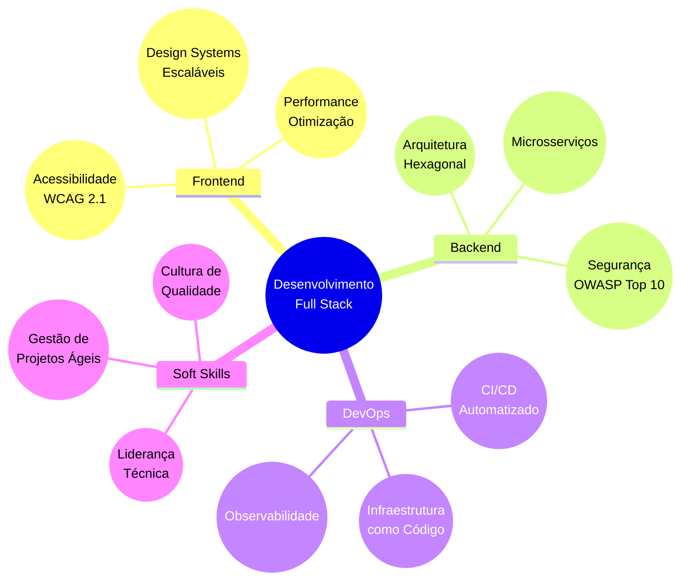

<div align="center">
 
 
</div>
<div>
  <h2>
    
    Sobre mim
  </h2>
</div>

Olá! Sou uma desenvolvedora Full Stack apaixonada por criar soluções que combinam funcionalidade e experiência do usuário. Estou atualmente cursando Ciência da Computação no IFSEMG, busco constantemente o equilíbrio entre código limpo e design intuitivo.

Minha jornada na tecnologia é movida pela curiosidade e pelo desafio de transformar problemas complexos em soluções elegantes. Acredito que os melhores softwares nascem da combinação entre conhecimento técnico sólido e sensibilidade para entender as necessidades do usuário final.

### O que eu busco:
- Oportunidades para aplicar e expandir meus conhecimentos em desenvolvimento web
- Equipes colaborativas onde possa aprender com desenvolvedores mais experientes
- Projetos que desafiem minha capacidade de resolver problemas

### Minha abordagem:
```typescript
function minhaFilosofia() {
  return {
    código: "Escrever código limpo e bem documentado",
    aprendizado: "Buscar conhecimento continuamente",
    colaboração: "Trabalhar efetivamente em equipe",
    problema: "Entender antes de resolver"
  };
}
```

<div>
  <h2>
    
    Tech Stack
  </h2>
</div>

<div >
  <h3> Front-end</h3>
  
  
  <h3> Back-end</h3>
  
  
  <h3> Ferramentas & Mais</h3>
  
</div>

<div>
  <h2>
    
    Projeto em Destaque
  </h2>
</div>

### [CapyCourses](https://github.com/StephanyeCunto/CapyCourses)
Plataforma de cursos online com foco em acessibilidade e experiência de usuário.
 
 **Tecnologias:** Java, JavaFX, SQLite, Hibernate

**Minha contribuição (UI/UX | Frontend):**
- Projetei interfaces de usuário intuitivas e acessíveis utilizando JavaFX
- Desenvolvi componentes de interface reutilizáveis com FXML e CSS
- Implementei animações e transições para melhorar a experiência do usuário
- Colaborei na criação de wireframes e protótipos para validação com usuários
- Otimizei o carregamento de componentes visuais para melhorar o desempenho

**Desafio superado:** Criar uma experiência de usuário consistente e acessível em uma aplicação desktop Java.

### [PaintBrush](https://github.com/StephanyeCunto/PaintBrush)  
Ferramenta de pintura digital que permite a criação e manipulação de formas geométricas em 2D e 3D.

**Tecnologias:** Java, JavaFX

**Responsável pelo projeto completo (UI/UX | Frontend | Backend):**  
- Desenvolvi integralmente o projeto, desde a concepção até a implementação final  
- Projetei e implementei interfaces intuitivas e acessíveis com JavaFX, FXML e CSS  
- Criei componentes visuais reutilizáveis e adicionei animações para uma experiência de usuário mais fluida  
- Implementei a lógica de manipulação gráfica utilizando Java puro

**Desafio superado:** Dominar a manipulação gráfica em tempo real com JavaFX, superando dificuldades com eventos e coordenadas para criar uma experiência fluida e precisa.

</div>

## 💭 Objetivos Profissionais

-  **Arquitetura Frontend**: Implementação de design systems escaláveis e acessíveis
-  **Clean Architecture**: Desenvolvimento de software sustentável com baixo acoplamento 
-  **Integração Full Stack**: Criação de experiências coesas entre frontend e backend
-  **Otimização de Performance**: Aplicações web de alta performance com métricas Core Web Vitals

##   O que me move

-  **Design e Arquitetura**: Acredito que software bem desenhado é mais fácil de manter e evoluir
-  **Aprendizado Contínuo**: Busco constantemente novas técnicas e abordagens para problemas conhecidos
-  **Colaboração**: Os melhores produtos nascem de equipes com diversidade de pensamento e experiências
-  **Inovação Pragmática**: Não basta ser novo, precisa resolver problemas reais de forma efetiva


## 📈 Crescimento & Aprendizado

| Fase | Competências | Status | Próximos Passos |
|------|--------------|--------|----------------|
| **Fundamentos** | HTML/CSS/JS, Acessibilidade | ✅ | Aprofundar CSS Grid e Flexbox |
| **Desenvolvimento Full Stack** | React, Node.js, APIs RESTful | ✅ | Estudar GraphQL e React Query |
| **Arquitetura & Qualidade** | Clean Code, Design Patterns, TDD | 🚧 | Implementar SOLID em projetos pessoais |
| **DevOps & Infraestrutura** | Docker, CI/CD | 🔜 | Configurar pipeline CI/CD com GitHub Actions |

<div>
  <h2>
    
Meu caminho de desenvolvimento  </h2>
</div>



<div>
  <h2>
    
    GitHub Stats
  </h2>
</div>

<div align="center">
   
  
</div>

  <br>
  


<div align="center">
  <br>
  <p>
    <br>
    <i>"Codando o futuro, um commit de cada vez" ✨</i>
  </p>
    <div>
    <a href="https://www.linkedin.com/in/stephanye-cunto-802b8922b/" target="_blank" rel="noopener noreferrer">
      
    </a>
    <a href="mailto:stephanyecristine6@gmail.com" target="_blank" rel="noopener noreferrer">
      
    </a>
    <a href="https://github.com/StephanyeCunto" target="_blank" rel="noopener noreferrer">
      
    </a>
  </div>


<a href="https://wakatime.com/@5a343522-23db-45ae-b20b-54655c392390" target="_blank" rel="noopener noreferrer">
  
</a>
</div>


</div>
