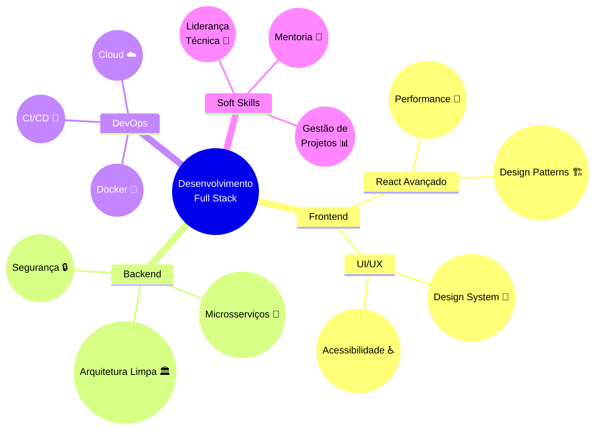

<div align="center">
 
 

[](https://git.io/typing-svg)

  <div>
    
    
    
  </div>

  <div>
    <a href="https://www.linkedin.com/in/stephanye-cunto-802b8922b/" target="_blank" rel="noopener noreferrer">
      
    </a>
    <a href="mailto:stephanyecristine6@gmail.com" target="_blank" rel="noopener noreferrer">
      
    </a>
    <a href="https://github.com/StephanyeCunto" target="_blank" rel="noopener noreferrer">
      
    </a>
  </div>
</div>

<div align="center">
  <h2>
    
    Sobre mim
  </h2>
</div>

```typescript
interface Developer {
  name: string;
  title: string;
  education: string;
  location: string;
  interests: string[];
  currentlyLearning: string[];
}

const me: Developer = {
  name: "Stephanye Cunto",
  title: "Full Stack Developer",
  education: "Computer Science @ IFSEMG",
  location: "Brazil",
  interests: ["Web Development", "UI/UX Design", "Clean Architecture"],
  currentlyLearning: ["Advanced React Patterns", "System Design", "DevOps"]
};
```

<div align="center">
  <h2>
    
    Tech Stack
  </h2>
</div>

<div align="center">
  <h3>🎀 Front-end</h3>
  
  
  <h3>💫 Back-end</h3>
  
  
  <h3>🌸 Ferramentas & Mais</h3>
  
</div>

<div align="center">
  <h2>
    
    Projeto em Destaque
  </h2>
</div>

<div align="center">
  <a href="https://github.com/StephanyeCunto/CapyCourses" target="_blank" rel="noopener noreferrer">
    
  </a>
  <a href="https://github.com/StephanyeCunto/PaintBrush" target="_blank" rel="noopener noreferrer">
    
  </a>

</div>

<div align="center">
  <h2>
    
    GitHub Stats
  </h2>
</div>

<div align="center">
   
  
</div>

<div align="center">
  <br>
  
</div>

  <h2 align="center"> Meu Roadmap de Aprendizado e Desenvolvimento</h2>

  <table>
    <thead>
      <tr>
        <th>Status</th>
        <th>Meta</th>
        <th>Descrição</th>
      </tr>
    </thead>
    <tbody>
      <tr>
        <td>✅</td>
        <td><strong>Java e JavaFX</strong></td>
        <td>Domínio completo de desenvolvimento desktop com JavaFX.</td>
      </tr>
      <tr>
        <td>✅</td>
        <td><strong>Desenvolvimento Full Stack</strong></td>
        <td>Construção de aplicações completas com front-end e back-end.</td>
      </tr>
      <tr>
        <td>🚧</td>
        <td><strong>UI/UX Design</strong></td>
        <td>Aprofundar conhecimentos em design de interfaces e experiência do usuário.</td>
      </tr>
      <tr>
        <td>🚧</td>
        <td><strong>Arquitetura de Software</strong></td>
        <td>Estudar padrões de projeto e arquiteturas escaláveis.</td>
      </tr>
      <tr>
        <td>🔜</td>
        <td><strong>DevOps</strong></td>
        <td>Aprender Docker, Kubernetes e CI/CD para automação de deploys.</td>
      </tr>
      <tr>
        <td>🔜</td>
        <td><strong>Open Source</strong></td>
        <td>Contribuir ativamente para projetos open source.</td>
      </tr>
    </tbody>
  </table>


<div align="center">
  <h2>
    
     Onde Quero Chegar
  </h2>
</div>

<h3>🎯 Meus Objetivos Profissionais</h3>
<ul>
  <li>✨ <strong>Desenvolver Soluções Inovadoras</strong>: Criar aplicações que resolvam problemas reais e impactem positivamente a vida das pessoas.</li>
  <li>🎨 <strong>Aprofundar Conhecimentos em UI/UX</strong>: Tornar-me referência em design de interfaces intuitivas e agradáveis.</li>
  <li>🌍 <strong>Contribuir para a Comunidade Tech</strong>: Compartilhar conhecimento através de artigos, tutoriais e projetos open source.</li>
  <li>🚀 <strong>Trabalhar em Projetos Desafiadores</strong>: Participar de equipes que desenvolvam soluções complexas e escaláveis.</li>
  <li>🛠️ <strong>Expandir Habilidades em DevOps</strong>: Dominar ferramentas de automação e infraestrutura como código.</li>
</ul>



<div align="center">
  <h2></h2>
  <br>
  <p>
    <br>
    <i>"Codando o futuro, um commit de cada vez" ✨</i>
  </p>


<a href="https://wakatime.com/@5a343522-23db-45ae-b20b-54655c392390" target="_blank" rel="noopener noreferrer">
  
</a>
</div>


</div>
