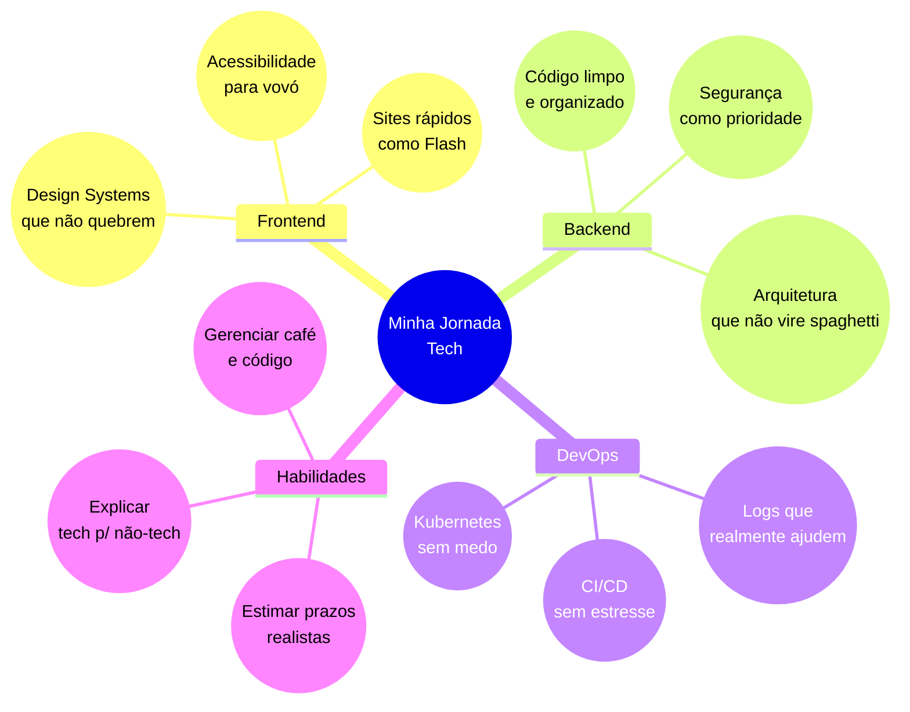

 
 

## 👋 Olá, mundo tech!

Oi! Sou a Stephanye, estudante de Ciência da Computação no IFSEMG e desenvolvedora Full Stack que acredita que todo problema de programação é um quebra-cabeça esperando para ser montado. 

Minha essência é encontrar o equilíbrio entre código limpo e interfaces que façam sentido para pessoas reais. Afinal, de que adianta a melhor arquitetura se ninguém consegue usar o produto final, não é mesmo?

### Quem sou eu por trás do código:
- Viciada em café ☕ (não consigo programar sem pelo menos 2 xícaras)
- Apaixonada por cores e gradientes (como você pode ver pelo meu perfil roxo-rosa 💕)
- Aluna dedicada que passa horas estudando tutoriais de novas tecnologias
- Perfeccionista assumida - prefiro entregar mais tarde do que entregar algo que não me orgulhe

> "O segredo não é corrigir bugs, é criar features tão boas que ninguém perceba os bugs" - Eu mesma, após virar a noite debugando

## 🛠️ Minha caixa de ferramentas

Sou aquela pessoa que adora mexer em todas as partes do projeto (sim, sou curiosa demais):

### 💻 Front-end (onde me sinto em casa)

### ⚙️ Back-end (onde a mágica acontece)

### 🔧 Ferramentas do dia a dia

## 🌟 Meus projetos 

### 🦊 CapyCourses
*Porque até as capivaras merecem educação de qualidade!*

Um projeto que nasceu da minha própria frustração com plataformas de cursos online pouco intuitivas. Decidi criar algo que até minha avó conseguiria usar (e olha que ela mal sabe ligar o celular!).

**Tecnologias:** Java, JavaFX, SQLite, Hibernate

**O que eu fiz:**
- Desenhei interfaces pensando em quem tem zero paciência para clicar em 10 botões
- Transformei conceitos complexos de UX em componentes simples e intuitivos
- Lutei contra o JavaFX para criar animações que não travassem o app inteiro
- Refatorei várias vezes até o código ficar tão limpo quanto a interface

**Desafio que quase me fez desistir:** Fazer o JavaFX parecer bonito em 2025! Quase impossível, mas consegui!

### 🎨 PaintBrush
*Meu xodó e pesadelo ao mesmo tempo*

Desenvolvi este projeto como um desafio pessoal para testar meus conhecimentos em programação gráfica e interfaces interativas.

**Tecnologias:** Java, JavaFX

**O que construí do zero:**  
- Arquitetei todo o sistema de renderização e manipulação de objetos
- Implementei algoritmos próprios para controle de formas 2D e 3D
- Criei uma interface minimalista mas poderosa, inspirada em ferramentas profissionais
- Otimizei cada função para garantir resposta imediata aos comandos do usuário

**Aprendizado mais valioso:** A importância do equilíbrio entre performance e usabilidade - sacrificar um pelo outro nunca é a resposta certa.

## 💭 O que me move 

As áreas que mais despertam minha paixão:

- **Arquitetura Frontend**: Adoro criar sistemas de design que tornam o desenvolvimento consistente e escalável
- **Clean Architecture**: Fascinada por estruturas de código sustentáveis que resistem ao teste do tempo
- **Código organizado**: Tenho prazer estético em ver um projeto bem estruturado e documentado
- **Acessibilidade**: Comprometida em criar tecnologia que funcione para todos, sem exceções
- **Otimização de Performance**: Obcecada com microsegundos e bytes, porque cada milissegundo de carregamento importa

## 🔍 O que me define como dev

- **Código limpo:** Tenho uma relação de amor quase religiosa com nomes de variáveis descritivos e funções pequenas
- **Curiosidade infinita:** Sou aquela que fica até 4h da manhã aprendendo uma nova tecnologia só porque achei interessante
- **Comunidade dev:** Acredito que juntos somos mais fortes (e debugamos mais rápido!)
- **Desafios impossíveis:** Me diz que algo não pode ser feito, e vou passar a semana tentando provar o contrário

 ## 📚 Minha jornada (spoiler: nunca acaba!)

| Fase | O que conquistei | Status | Próxima obsessão |
|------|--------------|--------|----------------|
| **Fundação** | HTML/CSS/JS e acessibilidade básica | ✅ | CSS Grid me deixa confusa às vezes |
| **Mergulho Full Stack** | React, Node.js, APIs RESTful | ✅ | Entender GraphQL (socorro!) |
| **Qualidade de código** | Clean Code e Design Patterns | 🚧 | Aplicar SOLID sem ficar overthinking |
| **DevOps** | Git avançado e Docker básico | 🔜 | Automatizar tudo com CI/CD |

## 🧠 Como organizo minha evolução técnica

## 📊 Minhas estatísticas (pra quem gosta de números)

   
  

   
  

     
    <i>"Se está funcionando, não mexa... mas se der pra otimizar, eu vou mexer!"</i>
  

  

    
    
    
  

