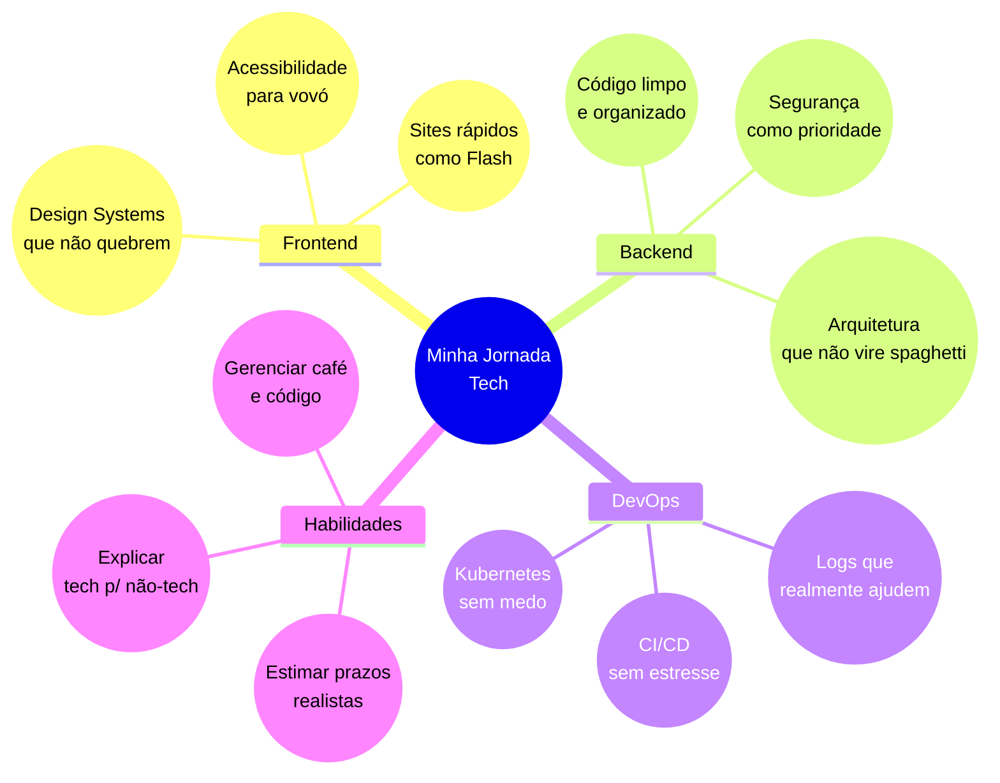

 
 

  
  
  
   
  

  

## 👋 Olá, mundo tech! 

Sou a **Stephanye**, estudante de Ciência da Computação no IFSEMG e desenvolvedora Full Stack que acredita que todo problema de programação é um quebra-cabeça esperando para ser montado. 
 
Minha essência é encontrar o equilíbrio entre código limpo e interfaces que façam sentido para pessoas reais. Afinal, de que adianta a melhor arquitetura se ninguém consegue usar o produto final, não é mesmo?

> *"O segredo não é corrigir bugs, é criar features tão boas que ninguém perceba os bugs"* — após uma madrugada de debugging

  
### 💫 Quem sou eu por trás do código:
- ☕ Viciada em café ☕ - Não consigo programar sem pelo menos 2 xícaras
- 🎨 Amante por cores e gradientes - O design é tão importante quanto a funcionalidade
- 📚 Aluna dedicada - Aquela passa horas estudando tutoriais de novas tecnologias
- ✨ Perfeccionista assumida - Prefiro entregar mais tarde do que entregar algo que não me orgulhe
  
 

## 🛠️ Tecnologias & Ferramentas
Sou aquela pessoa que adora mexer em todas as partes do projeto (sim, sou curiosa demais):

### 💻 Front-end (onde me sinto em casa)

### ⚙️ Back-end (onde a mágica acontece)

### 🔧 Ferramentas do dia a dia

 

## 🌟 Projetos Destacados

<table>
  <tr>
     <td width="50%" align="center">
      <h3><a href="https://github.com/StephanyeCunto/ComputacaoGrafica" target="_blank">🌌 Sistema Solar 3D</a></h3>
      
<em>Da órbita de Mercúrio até os anéis de Saturno</em>

      
      
<strong>Tecnologias:</strong> Three.js, WebGL, JavaScript ES6+, Vite

      
<strong>Características implementadas:</strong>

      <ul align="left">
        <li>Renderização 3D de alta qualidade com WebGL</li>
        <li>Simulação de órbitas planetárias com física simplificada</li>
        <li>Texturas e iluminação realistas para cada planeta</li>
        <li>Terra com mapa normal e camada atmosférica animada</li>
        <li>Sistema otimizado para renderizar milhares de estrelas</li>
      </ul>
      
<strong>Maior desafio:</strong> Implementar as leis de Kepler usando equações paramétricas para órbitas elípticas precisas.

    </td>
    <td width="50%" align="center">
      <h3><a href="https://github.com/StephanyeCunto/CapyCourses" target="_blank">🦊 CapyCourses</a></h3>
      
<em>Porque até as capivaras merecem educação de qualidade!</em>

      
      
<strong>Tecnologias:</strong> Java, JavaFX, SQLite, Hibernate

      
<strong>O que eu fiz:</strong>

      <ul align="left">
        <li>Desenhei interfaces pensando em quem tem zero paciência para clicar em 10 botões</li>
        <li>Transformei conceitos complexos de UX em componentes simples e intuitivos</li>
        <li>Lutei contra o JavaFX para criar animações que não travassem o app inteiro</li>
        <li>Refatorei várias vezes até o código ficar tão limpo quanto a interface</li>
      </ul>
      
<strong>Desafio que quase me fez desistir:</strong> Fazer o JavaFX parecer bonito em 2025! Quase impossível, mas consegui!

    </td>
   </tr>
   <tr>
    <td width="50%" align="center">
      <h3><a href="https://github.com/StephanyeCunto/PaintBrush" target="_blank">🎨 PaintBrush</a></h3>
      
<em>Meu xodó e pesadelo ao mesmo tempo</em>

      
      
<strong>Tecnologias:</strong> Java, JavaFX

      
<strong>O que construí do zero:</strong>

      <ul align="left">
        <li>Arquitetei todo o sistema de renderização e manipulação de objetos</li>
        <li>Implementei algoritmos próprios para controle de formas 2D e 3D</li>
        <li>Criei uma interface minimalista mas poderosa, inspirada em ferramentas profissionais</li>
        <li>Otimizei cada função para garantir resposta imediata aos comandos do usuário</li>
      </ul>
      
<strong>Aprendizado mais valioso:</strong> A importância do equilíbrio entre performance e usabilidade - sacrificar um pelo outro nunca é a resposta certa.

    </td>
  </tr>
</table>

 

## 💭 O que me move 

As áreas que mais despertam minha paixão:

- **Arquitetura Frontend**: Adoro criar sistemas de design que tornam o desenvolvimento consistente e escalável
- **Clean Architecture**: Fascinada por estruturas de código sustentáveis que resistem ao teste do tempo
- **Código organizado**: Tenho prazer estético em ver um projeto bem estruturado e documentado
- **Acessibilidade**: Comprometida em criar tecnologia que funcione para todos, sem exceções
- **Otimização de Performance**: Obcecada com microsegundos e bytes, porque cada milissegundo de carregamento importa

 

## 🔍 O que me define como dev

<table>
  <tr>
    <td align="center">
      
       <strong>Código limpo</strong> 
       <small>Tenho uma relação de amor quase religiosa com nomes de variáveis descritivos e funções pequenas</small>
    </td>
    <td align="center">
      
       <strong>Curiosidade infinita</strong> 
       <small>Sou aquela que fica até 4h da manhã aprendendo uma nova tecnologia só porque achei interessante</small>
    </td>
    <td align="center">
      
       <strong>Comunidade dev</strong> 
       <small>Acredito que juntos somos mais fortes (e debugamos mais rápido!)</small>
    </td>
    <td align="center">
      
       <strong>Desafios impossíveis</strong> 
       <small>Me diga que algo não pode ser feito, e vou passar a semana tentando provar o contrário</small>
    </td>
  </tr>
</table>

 

 ## 📚 Minha jornada (spoiler: nunca acaba!)

 | Fase | O que conquistei | Status | Próxima obsessão |
|------|--------------|--------|----------------|
| **Fundação** | HTML/CSS/JS e acessibilidade básica | ✅ | CSS Grid me deixa confusa às vezes |
| **Mergulho Full Stack** | React, Node.js, APIs RESTful | ✅ | Entender GraphQL (socorro!) |
| **Qualidade de código** | Clean Code e Design Patterns | 🚧 | Aplicar SOLID sem ficar overthinking |
| **DevOps** | Git avançado e Docker básico | 🔜 | Automatizar tudo com CI/CD |

 

## 🧠 Como organizo minha evolução técnica
 

  

## 📊 Minhas estatísticas (pra quem gosta de números)

  

  

 
> "Se está funcionando, não mexa... mas se der pra otimizar, eu vou mexer!"

